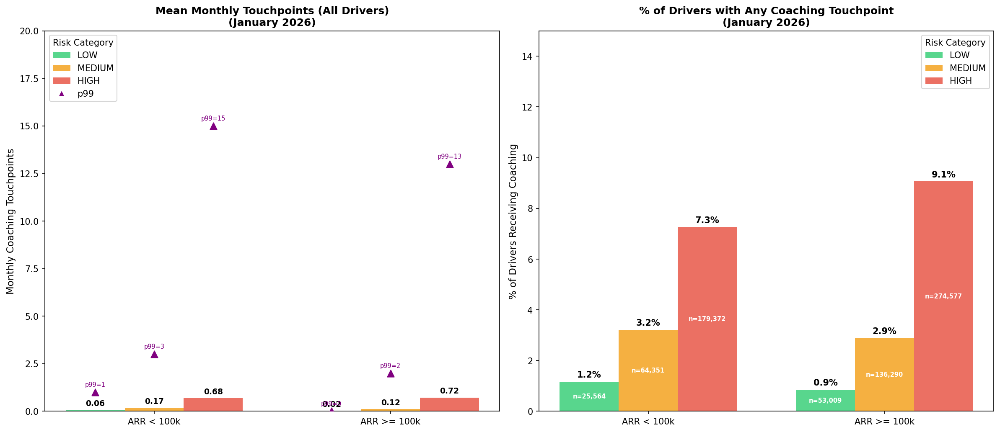

# Coaching Touchpoints Benchmark Analysis

**Date:** February 4, 2026  
**Author:** Data Analytics  
**Status:** Draft  
**Updated:** February 5, 2026 (corrected join to include all drivers)

---

## Goal

Determine what a "healthy" level of coaching touchpoints looks like by comparing distributions across pre-assigned driver risk categories and comparing customers with ARR < 100k vs ARR ≥ 100k.

---

## Definitions

| Term | Definition |
|------|------------|
| **Coaching touchpoints** | Count of distinct `coachable_item_uuid` where `share_type IN (1, 2)` — Self-Review OR Manager-Led Coaching. Excludes training. |
| **Weekly period** | Jan 26 – Feb 1, 2026 |
| **Monthly period** | Jan 1 – Jan 31, 2026 |
| **Driver risk category** | From `product_analytics.driver_risk_classification` as of Feb 1, 2026 (LOW, MEDIUM, HIGH) |
| **ARR segment** | Derived from `account_arr_segment` in `datamodel_core.dim_organizations`: `ARR < 100k` or `ARR >= 100k` |

---

## Data Sources

| Source | Purpose |
|--------|---------|
| `coachingdb_shards.coaching_sessions` | Coaching session metadata |
| `coachingdb_shards.coachable_item` | Individual coaching items per session |
| `coachingdb_shards.coachable_item_share` | Share type (1=Self-Review, 2=Manager-Led) |
| `product_analytics.driver_risk_classification` | Driver risk category (LOW/MEDIUM/HIGH) |
| `datamodel_core.dim_organizations` | Account ARR segment |

---

## Summary Results

### Population Overview

| Metric | Count | % |
|--------|-------|---|
| **Total drivers with risk classification** | 733,163 | 100% |
| **Drivers with any coaching (monthly)** | 44,674 | 6.1% |
| **Drivers with zero coaching** | 688,489 | 93.9% |

### % of Drivers Receiving Any Coaching by Risk Level & ARR Segment

| ARR Segment | Risk Level | Total Drivers | Drivers Coached | % Coached |
|-------------|------------|---------------|-----------------|-----------|
| ARR < 100k | LOW | 25,564 | 299 | 1.2% |
| ARR < 100k | MEDIUM | 64,351 | 2,070 | 3.2% |
| ARR < 100k | HIGH | 179,372 | 13,032 | 7.3% |
| ARR >= 100k | LOW | 53,009 | 454 | 0.9% |
| ARR >= 100k | MEDIUM | 136,290 | 3,933 | 2.9% |
| ARR >= 100k | HIGH | 274,577 | 24,886 | 9.1% |

### Monthly Touchpoints (All Drivers, Including Zeros)

| ARR Segment | Risk Level | N Drivers | p50 | p90 | p99 | Mean |
|-------------|------------|-----------|-----|-----|-----|------|
| ARR < 100k | LOW | 25,564 | 0 | 0 | 1 | 0.06 |
| ARR < 100k | MEDIUM | 64,351 | 0 | 0 | 3 | 0.17 |
| ARR < 100k | HIGH | 179,372 | 0 | 0 | 15 | 0.68 |
| ARR >= 100k | LOW | 53,009 | 0 | 0 | 0 | 0.02 |
| ARR >= 100k | MEDIUM | 136,290 | 0 | 0 | 2 | 0.12 |
| ARR >= 100k | HIGH | 274,577 | 0 | 0 | 13 | 0.72 |

---

## Visualizations



**Left chart:** Monthly coaching touchpoints for drivers who received coaching, by risk level and ARR segment, with mean (blue diamond) and p90 (purple triangle) markers.

**Right chart:** Percentage of drivers receiving any coaching touchpoint by risk level within each ARR segment.

---

## Key Takeaways

### 1. Most Drivers Receive No Coaching

- **93.9% of drivers** had zero coaching touchpoints in January 2026
- Only **6.1%** received any coaching (self-review or manager-led)
- This is consistent across both ARR segments

### 2. Coaching is Risk-Aligned

- **HIGH-risk drivers** are most likely to receive coaching:
  - ARR < 100k: 7.3% of HIGH vs 1.2% of LOW
  - ARR >= 100k: 9.1% of HIGH vs 0.9% of LOW
- HIGH-risk drivers receive **6-10x higher coaching rates** than LOW-risk drivers

### 3. Larger Customers (ARR >= 100k) Coach Slightly More

- HIGH-risk coaching rate: 9.1% (ARR >= 100k) vs 7.3% (ARR < 100k)
- This may reflect more mature safety programs at larger organizations

### 4. When Drivers Are Coached, Volume is Similar

- Among coached drivers, mean monthly touchpoints are similar across ARR segments
- HIGH-risk coached drivers: ~7-9 touchpoints/month on average

---

## Benchmarks

Based on this analysis, here are suggested coaching benchmarks:

| Metric | Current State | Suggested Benchmark |
|--------|---------------|---------------------|
| % of HIGH-risk drivers coached | 7-9% | Target 15-20% |
| Monthly touchpoints for coached HIGH-risk | 7-9 mean | Maintain or increase |
| % of LOW-risk drivers coached | ~1% | Acceptable (focus on HIGH) |

---

## SQL Query

```sql
WITH coaching_touchpoints AS (
  SELECT 
    cs.org_id, 
    ci.driver_id,
    COUNT(DISTINCT CASE 
      WHEN ci.date BETWEEN '2026-01-26' AND '2026-02-01' 
      THEN ci.uuid 
    END) AS touchpoints_weekly,
    COUNT(DISTINCT CASE 
      WHEN ci.date BETWEEN '2026-01-01' AND '2026-01-31' 
      THEN ci.uuid 
    END) AS touchpoints_monthly
  FROM coachingdb_shards.coaching_sessions cs
  JOIN coachingdb_shards.coachable_item ci 
    ON cs.uuid = ci.coaching_session_uuid
  JOIN coachingdb_shards.coachable_item_share cis 
    ON ci.uuid = cis.coachable_item_uuid
  WHERE cis.share_type IN (1, 2)  -- Self-Review or Manager-Led
    AND ci.date BETWEEN '2026-01-01' AND '2026-02-01'
    AND ci.driver_id IS NOT NULL 
    AND ci.driver_id != 0
  GROUP BY cs.org_id, ci.driver_id
),
risk_classification AS (
  SELECT org_id, driver_id, classification AS driver_risk_category
  FROM product_analytics.driver_risk_classification
  WHERE date = '2026-02-01'
),
org_arr AS (
  SELECT 
    org_id,
    CASE 
      WHEN account_arr_segment IN ('100k - 500K', '500K - 1M', '1M+') 
      THEN 'ARR >= 100k' 
      ELSE 'ARR < 100k' 
    END AS org_arr_segment
  FROM datamodel_core.dim_organizations
  WHERE date = '2026-02-01' 
    AND is_paid_customer = TRUE
)
SELECT 
  rc.driver_id,
  rc.org_id,
  rc.driver_risk_category,
  COALESCE(ct.touchpoints_weekly, 0) AS touchpoints_weekly,
  COALESCE(ct.touchpoints_monthly, 0) AS touchpoints_monthly,
  oa.org_arr_segment
FROM risk_classification rc
LEFT JOIN coaching_touchpoints ct 
  ON rc.org_id = ct.org_id AND rc.driver_id = ct.driver_id
LEFT JOIN org_arr oa 
  ON rc.org_id = oa.org_id
WHERE oa.org_arr_segment IS NOT NULL
```

**Note:** The key change from the initial analysis is using `risk_classification LEFT JOIN coaching_touchpoints` instead of the reverse. This ensures ALL drivers with a risk classification are included, not just those who received coaching.

---

## Files

| File | Description |
|------|-------------|
| `coaching_analysis_data.csv` | Driver-level data (733,163 rows) |
| `coaching_analysis_charts.png` | Visualization charts |
| `coaching_touchpoints_benchmark_analysis.md` | This document |

---

## Appendix: Coaching Touchpoint Definitions

From `backend/dataplatform/dataweb/userpkgs/safety_constants.py`:

| share_type | Coaching Type | Description |
|------------|---------------|-------------|
| 1 | Self-Review (Self-Coaching) | Driver reviews the safety event on their own via the app |
| 2 | Manager-Led Coaching | A coach/manager reviews the event with the driver |

**Note:** Training (`product_type = 3` from `formsdb`) is tracked separately and is NOT included in coaching touchpoints.
