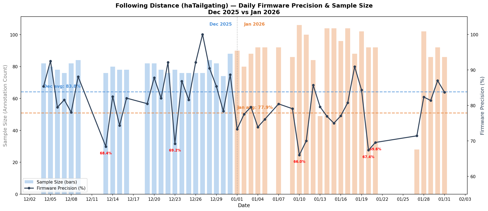
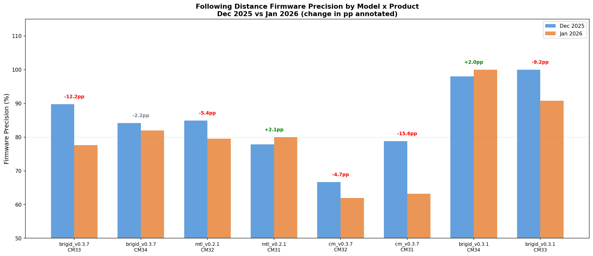
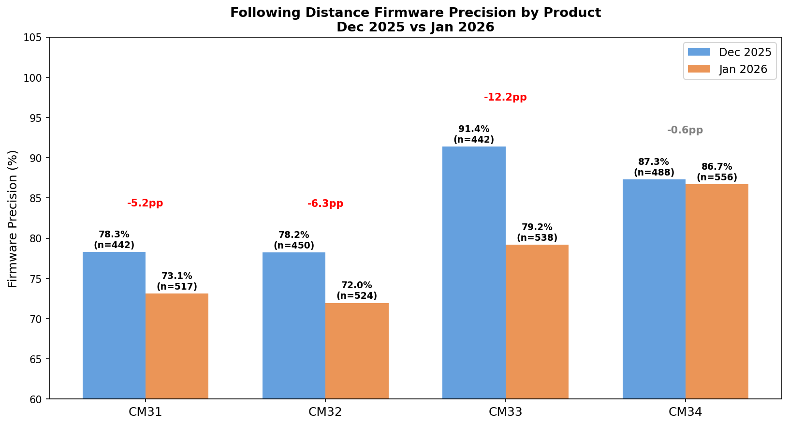
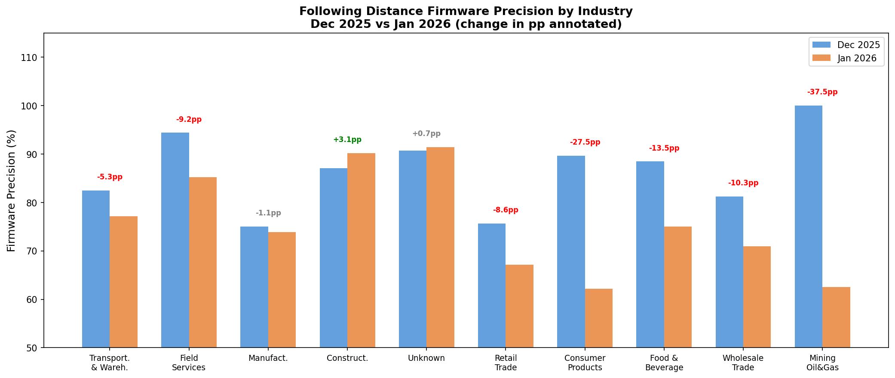
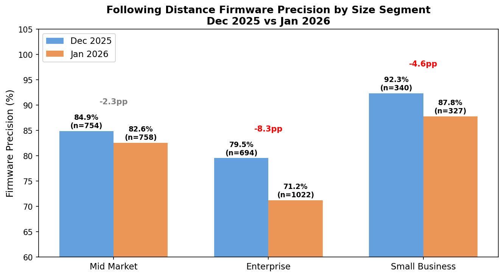
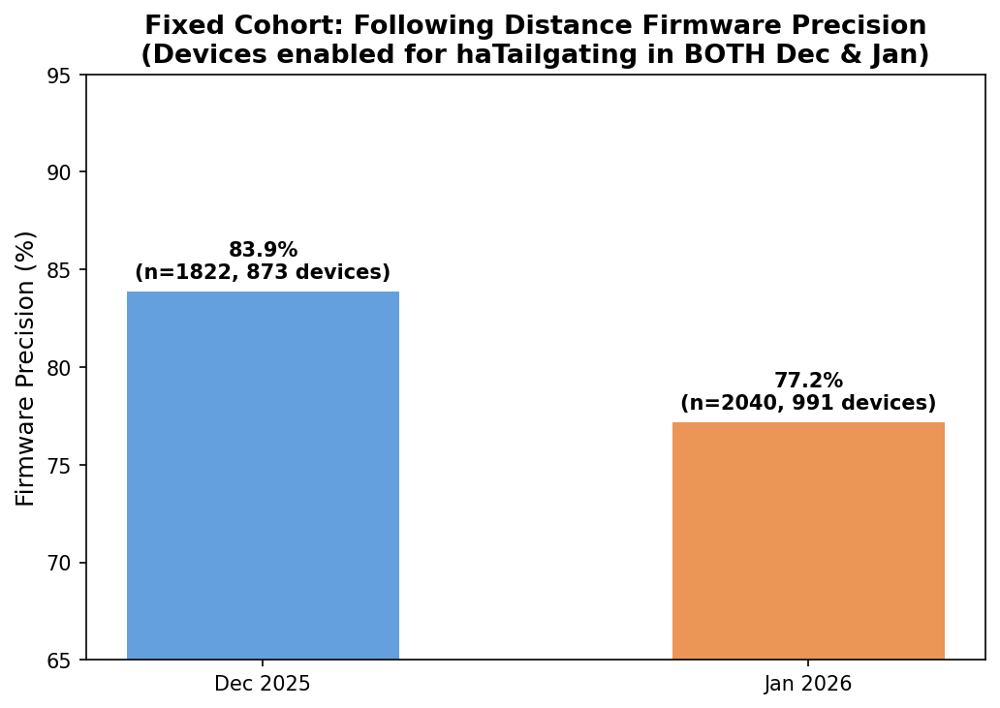
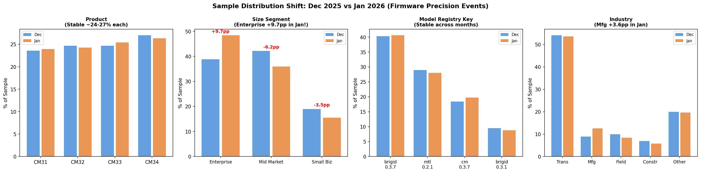
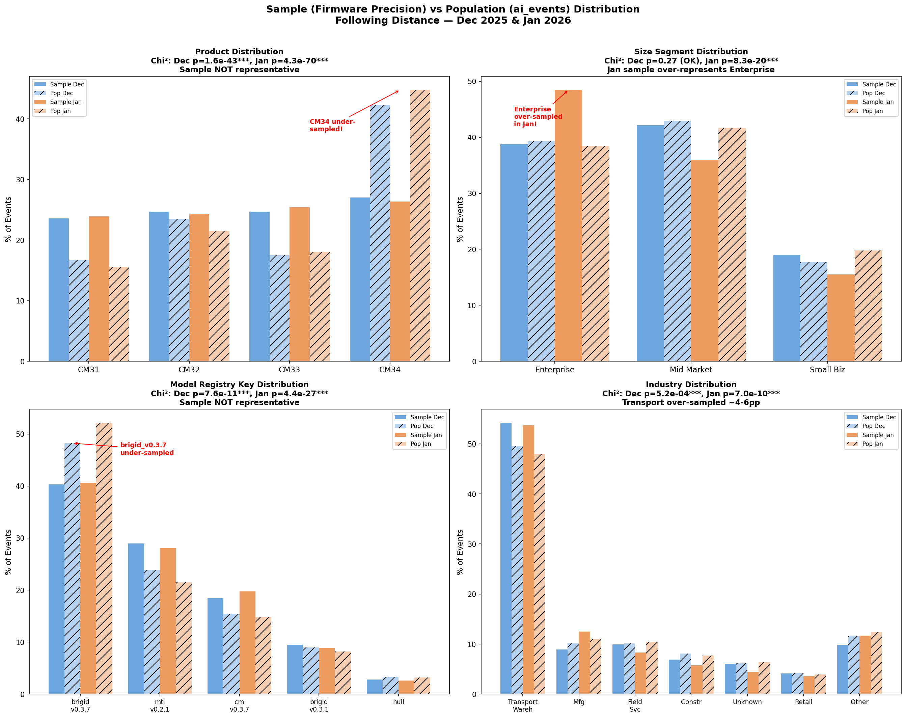

# Following Distance (haTailgating) Firmware Precision Drop Analysis

**Date:** 2026-02-06
**Period Under Investigation:** Dec 2025 vs Jan 2026
**Detection Type:** haTailgating (Following Distance)
**Dataset:** `na_std_precision` from `dojo.metrics_std_tailgating`

---

## Executive Summary

Following Distance firmware precision dropped from **83.8% in Dec 2025** to **77.9% in Jan 2026** (a **-5.9pp decline**). This analysis breaks down the drop by daily trends, model registry key, product name, industry, account size segment, and a fixed device cohort. Key findings:

1. **Not a single-day outlier** — the drop is spread across multiple days in January, with the worst days being Jan 10 (66.0%), Jan 20 (67.4%), and Jan 21 (69.6%).
2. **`outward-mtl_cm_v0.3.7` model is the worst performer** — precision fell from 73.5% to 62.6% (-10.9pp), and it carries significant volume (354 → 438 events).
3. **CM33 saw the largest product-level decline** — precision dropped from 91.4% to 79.2% (-12.2pp), driven by the `brigid_v0.3.7` model. CM32 also dropped -6.3pp, while CM34 was stable (-0.6pp).
4. **Enterprise segment drove the most volume increase** with a large precision drop — from 79.5% to 71.2% (-8.3pp) on 694 → 1,022 events.
5. **Fixed cohort analysis confirms the drop is real** — among devices enabled in both months, precision went from 83.9% to 77.2% (-6.7pp).

---

## 1. Daily Firmware Precision Trend

The chart below shows daily firmware precision (line) and sample size (bars) for Dec 2025 and Jan 2026. December days are shown in blue, January in orange. The dashed lines indicate monthly averages.

### Key Observations

- **Dec 2025 average:** 83.8% (22 days, ~78–88 events/day)
- **Jan 2026 average:** 77.9% (24 days, ~80–106 events/day)
- January had **higher sample sizes** on many days (several days with 92–106 events vs Dec's 74–88), so the precision drop is not just a sample-size artifact.

### Worst Days in January (< 72% precision)

| Date | Annotations | TP Count | Precision |
|------|------------|----------|-----------|
| 2026-01-10 | 106 | 70 | **66.0%** |
| 2026-01-20 | 92 | 62 | **67.4%** |
| 2026-01-21 | 92 | 64 | **69.6%** |
| 2026-01-11 | 100 | 70 | **70.0%** |
| 2026-01-27 | 28 | 20 | 71.4% (low n) |

### Worst Days in December (for comparison)

| Date | Annotations | TP Count | Precision |
|------|------------|----------|-----------|
| 2025-12-13 | 76 | 52 | **68.4%** |
| 2025-12-23 | 78 | 54 | **69.2%** |

December only had 2 days below 70%, whereas January had 4 days below 72% and sustained lower precision throughout.

---

## 2. Breakdown by Model Registry Key

### Aggregated by Model (Dec vs Jan)

| Model Registry Key | Dec Events | Dec Precision | Jan Events | Jan Precision | Change |
|----|----|----|----|----|-----|
| outward-mtl_brigid_v0.3.7 | 726 | **87.1%** | 861 | **79.6%** | **-7.5pp** |
| outward-mtl_v0.2.1 | 522 | **81.6%** | 593 | **79.8%** | **-1.8pp** |
| outward-mtl_cm_v0.3.7 | 354 | **73.5%** | 438 | **62.6%** | **-10.9pp** |
| outward-mtl_brigid_v0.3.1 | 170 | **98.8%** | 186 | **96.8%** | **-2.0pp** |
| null | 50 | 84.0% | 55 | 92.7% | +8.7pp |

### Key Findings — Model

- **`outward-mtl_cm_v0.3.7`** is the worst performer and had the **largest precision drop** (-10.9pp to 62.6%). It also increased in volume from 354 → 438 events.
- **`outward-mtl_brigid_v0.3.7`** is the highest-volume model and dropped by -7.5pp (87.1% → 79.6%). This model alone contributes a large share of the overall decline.
- **`outward-mtl_brigid_v0.3.1`** remains excellent (>96%) and is stable.
- **`outward-mtl_v0.2.1`** had a smaller drop (-1.8pp), relatively stable.

### Breakdown by Model x Product

Each model runs on specific camera hardware. The model-to-product mapping and Dec→Jan precision changes:

| Model | Product | Dec Precision (n) | Jan Precision (n) | Change |
|-------|---------|------|------|--------|
| outward-mtl_cm_v0.3.7 | CM31 | 78.8% (198) | 63.2% (212) | **-15.6pp** |
| outward-mtl_brigid_v0.3.7 | CM33 | 89.8% (372) | 77.6% (473) | **-12.2pp** |
| outward-mtl_brigid_v0.3.1 | CM33 | 100.0% (70) | 90.8% (65) | **-9.2pp** |
| outward-mtl_v0.2.1 | CM32 | 84.9% (278) | 79.5% (288) | **-5.4pp** |
| outward-mtl_cm_v0.3.7 | CM32 | 66.7% (156) | 62.0% (226) | -4.7pp |
| outward-mtl_brigid_v0.3.7 | CM34 | 84.2% (354) | 82.0% (388) | -2.2pp |
| outward-mtl_v0.2.1 | CM31 | 77.9% (244) | 80.0% (305) | +2.1pp |
| outward-mtl_brigid_v0.3.1 | CM34 | 98.0% (100) | 100.0% (121) | +2.0pp |

The **largest contributors** to the overall drop are:
1. `outward-mtl_cm_v0.3.7` on **CM31**: -15.6pp (78.8% → 63.2%)
2. `outward-mtl_brigid_v0.3.7` on **CM33**: -12.2pp (89.8% → 77.6%) — highest volume combo
3. `outward-mtl_brigid_v0.3.1` on **CM33**: -9.2pp (100.0% → 90.8%)

Notable model-to-product mapping:
- `brigid_v0.3.7` and `brigid_v0.3.1` → **CM33, CM34**
- `mtl_v0.2.1` and `cm_v0.3.7` → **CM31, CM32**

---

## 3. Breakdown by Product Name

| Product | Dec Precision (n) | Jan Precision (n) | Change |
|---------|------|------|--------|
| CM33 | 91.4% (442) | 79.2% (538) | **-12.2pp** |
| CM32 | 78.2% (450) | 72.0% (524) | **-6.3pp** |
| CM31 | 78.3% (442) | 73.1% (517) | **-5.2pp** |
| CM34 | 87.3% (488) | 86.7% (556) | -0.6pp |

**CM33 had the steepest decline** (-12.2pp, from 91.4% → 79.2%), primarily driven by the `brigid_v0.3.7` model regressing on CM33 hardware. CM32 and CM31 also declined (-6.3pp and -5.2pp respectively), while **CM34 was essentially stable** (-0.6pp). All four products saw increased event volumes in January.

---

## 4. Breakdown by Account Industry

| Industry | Dec Prec (n) | Jan Prec (n) | Change |
|----------|------|------|--------|
| Transportation & Warehousing | 82.5% (970) | 77.1% (1,132) | **-5.4pp** |
| Manufacturing | 75.0% (160) | 73.9% (264) | -1.1pp |
| Field Services | 94.4% (178) | 85.2% (176) | **-9.2pp** |
| Construction | 87.1% (124) | 90.2% (122) | +3.1pp |
| Unknown | 90.7% (108) | 91.4% (93) | +0.7pp |
| Retail Trade | 75.7% (74) | 67.1% (76) | **-8.6pp** |
| Consumer Products | 89.7% (58) | 62.2% (37) | **-27.5pp** |
| Food & Beverage | 88.5% (52) | 75.0% (72) | **-13.5pp** |
| Wholesale Trade | 81.3% (32) | 71.0% (62) | **-10.3pp** |
| Mining, Quarrying, Oil & Gas | 100.0% (14) | 62.5% (32) | **-37.5pp** |

### Key Findings — Industry

- **Transportation & Warehousing** is by far the largest segment (~55% of events) and declined -5.4pp. This is the largest absolute contributor to the overall drop.
- Several smaller industries saw **dramatic drops**: Consumer Products (-27.5pp), Mining/Oil & Gas (-37.5pp), Food & Beverage (-13.5pp), Wholesale Trade (-10.3pp).
- **Construction** and **Unknown** actually *improved* slightly in January.

---

## 5. Breakdown by Account Size Segment

| Size Segment | Dec Precision (n) | Jan Precision (n) | Change |
|-------------|------|------|--------|
| Enterprise | 79.5% (694) | 71.2% (1,022) | **-8.3pp** |
| Mid Market | 84.9% (754) | 82.6% (758) | **-2.3pp** |
| Small Business | 92.4% (340) | 87.8% (327) | **-4.6pp** |

### Key Findings — Size Segment

- **Enterprise** had the biggest drop (-8.3pp) and its volume **grew significantly** (694 → 1,022 events, a 47% increase). This dilution of the sample with more Enterprise events — which have lower base precision — partially explains the overall decline.
- **Mid Market** relatively stable (-2.3pp).
- **Small Business** dropped -4.6pp but from a high base (92.4%).

---

## 6. Fixed Cohort Analysis

To control for fleet composition changes between months, we restricted to devices that had Following Distance (haTailgating) enabled in **both** Dec 2025 and Jan 2026, as tracked in `dojo.device_ai_features_daily_snapshot`.

| Month | Unique Devices | Annotations | TP Count | Precision |
|-------|---------------|-------------|----------|-----------|
| Dec 2025 | 873 | 1,822 | 1,528 | **83.9%** |
| Jan 2026 | 991 | 2,040 | 1,574 | **77.2%** |

### Key Finding — Fixed Cohort

Even among the **same set of devices** present in both months, firmware precision dropped from **83.9% to 77.2% (-6.7pp)**. This confirms the decline is **not simply due to new devices or fleet composition changes** — the same devices are experiencing lower precision in January.

> Note: The unique device count increased from 873 → 991 because the same device may appear on more days in January (more active days = more events captured).

---

## Summary of Root Cause Hypotheses

Based on the breakdowns above, the following factors are likely contributing to the Dec → Jan precision drop:

| Factor | Evidence | Impact |
|--------|----------|--------|
| **`outward-mtl_cm_v0.3.7` model degradation on CM31** | -15.6pp on CM31 (78.8% → 63.2%) | High — largest single model x product swing |
| **`outward-mtl_brigid_v0.3.7` model regression on CM33** | -12.2pp on CM33 (89.8% → 77.6%) | High — largest volume model x product combo |
| **CM33 product-level drop** | -12.2pp overall (91.4% → 79.2%) | High — steepest product-level decline |
| **Enterprise segment growth + lower precision** | Enterprise grew 47% in volume, precision -8.3pp | Medium-High — composition shift amplifies drop |
| **Industry mix: small but volatile segments** | Consumer Products -27.5pp, Mining -37.5pp | Low-Medium — small sample sizes, but signal of broader FP issues |
| **Fixed cohort confirms real model/environment change** | -6.7pp on same devices | Confirms this is not a fleet composition artifact |

### Recommended Next Steps

1. **Investigate `outward-mtl_cm_v0.3.7` model on CM31** — this model/product combo had the steepest decline (-15.6pp). Was there a model update or config change in late Dec / early Jan?
2. **Investigate `outward-mtl_brigid_v0.3.7` on CM33** — as the highest-volume combo, its -12.2pp regression is the largest absolute contributor to the overall drop.
3. **Review the Jan 10–11 and Jan 20–21 spikes in FP events** — these days contributed disproportionately to the monthly drop. Check if there were environmental factors (weather, holidays) or batch processing issues.
4. **Examine Enterprise orgs driving the volume increase** — identify if specific large Enterprise accounts are generating more FP events in January.
5. **Review labeling consistency** — confirm that annotation quality/labeler behavior did not change between Dec and Jan batches.

---

## 7. Sample Distribution by Segment (Dec vs Jan)

This section examines whether the firmware precision sample is evenly distributed across segments, and whether the mix shifted between December and January.

### Product Distribution (in sample)

| Product | Dec Sample % | Jan Sample % | Change |
|---------|-------------|-------------|--------|
| CM31 | 23.6% (422) | 23.9% (505) | +0.4pp |
| CM32 | 24.7% (442) | 24.3% (512) | -0.4pp |
| CM33 | 24.7% (442) | 25.4% (536) | +0.7pp |
| CM34 | 27.0% (484) | 26.4% (556) | -0.7pp |

Product distribution is **stable** between months — roughly 24–27% each. The sample distributes events nearly uniformly across products.

### Size Segment Distribution (in sample)

| Size Segment | Dec Sample % | Jan Sample % | Change |
|-------------|-------------|-------------|--------|
| Enterprise | 38.8% (694) | **48.5% (1,022)** | **+9.7pp** |
| Mid Market | 42.1% (754) | 35.9% (758) | -6.2pp |
| Small Business | 19.0% (340) | 15.5% (327) | -3.5pp |

**Enterprise share grew significantly** in the January sample (+9.7pp), from 38.8% to 48.5%. Since Enterprise has the lowest precision among segments, this composition shift mechanically lowers the overall precision metric in January.

### Model Distribution (in sample)

| Model | Dec Sample % | Jan Sample % | Change |
|-------|-------------|-------------|--------|
| brigid_v0.3.7 | 40.3% (722) | 40.7% (857) | +0.3pp |
| mtl_v0.2.1 | 28.9% (518) | 28.0% (591) | -0.9pp |
| cm_v0.3.7 | 18.4% (330) | 19.7% (416) | +1.3pp |
| brigid_v0.3.1 | 9.5% (170) | 8.8% (186) | -0.7pp |

Model distribution is **stable** between months — no significant shifts.

### Key Finding — Sample Segment Shift

The **only major shift** in the sample between Dec and Jan is the **Enterprise segment over-representation** in January. This is important because Enterprise has the lowest precision, so its increased share amplifies the overall monthly decline. However, as shown in the fixed cohort analysis (Section 6), the precision drop persists even on the same devices, so composition shift is a contributing factor but not the sole cause.

---

## 8. Sample Representativeness vs Population (Chi-Squared Tests)

To assess whether the firmware precision sample is representative of all Following Distance events, we compared the sample distribution against the **full population** from `dojo.ai_events` (filtered to paid customer orgs, no SHADOW, CM31–CM34, US/CA/MX locale) using chi-squared goodness-of-fit tests.

### Chi-Squared Test Summary

| Dimension | Month | Chi² | df | p-value | Representative? |
|-----------|-------|------|-----|---------|-----------------|
| **Product** | Dec 2025 | 201.93 | 3 | 1.6e-43 | **NO** |
| **Product** | Jan 2026 | 324.77 | 3 | 4.3e-70 | **NO** |
| **Size Segment** | Dec 2025 | 3.91 | 3 | 0.27 | **YES** |
| **Size Segment** | Jan 2026 | 91.95 | 3 | 8.3e-20 | **NO** |
| **Model** | Dec 2025 | 56.15 | 5 | 7.6e-11 | **NO** |
| **Model** | Jan 2026 | 133.47 | 5 | 4.4e-27 | **NO** |
| **Industry** | Dec 2025 | 29.59 | 9 | 5.2e-04 | **NO** |
| **Industry** | Jan 2026 | 61.47 | 9 | 7.0e-10 | **NO** |

### Key Biases Identified

#### 1. Product: CM34 is massively under-sampled

| Product | Sample % | Population % | Bias |
|---------|----------|-------------|------|
| CM31 | ~24% | ~16% | **+8pp over-sampled** |
| CM32 | ~24% | ~22% | ~even |
| CM33 | ~25% | ~18% | **+7pp over-sampled** |
| CM34 | ~27% | ~44% | **-17pp under-sampled** |

The sample distributes events nearly uniformly (~25% each), but **CM34 accounts for ~44% of all population events** — it is dramatically under-represented. Conversely, CM31 and CM33 are over-sampled by 7–8pp each.

**Implication:** CM34 is the most stable product (precision only dropped -0.6pp), so under-sampling it makes the sample precision more volatile and more susceptible to swings on the less-stable CM31/CM32/CM33 products.

#### 2. Size Segment: Dec was representative, Jan is not

- **December** sample closely matches the population (p=0.27, not significant).
- **January** sample over-represents Enterprise (48.5% vs 38.5% in population, +10pp gap). Enterprise has the lowest precision, so this bias inflates the apparent January decline.

#### 3. Model: brigid_v0.3.7 is under-sampled

The largest-volume model (`brigid_v0.3.7`, ~48–52% of population events) is under-sampled at ~40% in the sample. Meanwhile, `mtl_v0.2.1` and `cm_v0.3.7` are over-sampled by ~5pp each.

**Implication:** `cm_v0.3.7` (the worst-performing model at 62.6% precision in Jan) is **over-represented** in the sample vs population, which drags the sample-level precision downward relative to what the true population precision would be.

#### 4. Industry: Transportation & Warehousing over-sampled

Transportation & Warehousing accounts for ~50% of population events but ~54% in the sample — a modest over-sampling of ~4–6pp. This industry declined -5.4pp in precision, so its over-representation slightly amplifies the measured drop.

### What This Means for the Precision Drop

The sampling biases cut in **two directions**:
- **Amplifying factors**: Over-sampling of Enterprise in Jan, over-sampling of `cm_v0.3.7` (worst model), and over-sampling of Transportation (which declined)
- **Dampening factors**: Under-sampling of CM34 (most stable product) means the sample misses the "dilution" effect of CM34's stability

**Bottom line**: The measured -5.9pp precision drop is likely **slightly overstated** relative to the true population precision change due to these sampling biases, but the directional decline is real (confirmed by the fixed cohort analysis).

---

## Appendix: Data Sources & Filters

- **Tailgating events:** `dojo.metrics_std_tailgating` with `dev_cfg_mlapp_fd_unsafe_following_distance_seconds >= 0.1`
- **Dataset:** `na_std_precision` (firmware samples only)
- **AI release stage:** Excluded `SHADOW`
- **Camera products:** CM31, CM32, CM33, CM34
- **Locale:** US, CA, MX
- **Device AI features:** `dojo.device_ai_features_daily_snapshot` (feature_enabled = 'haTailgating')
- **Organizations:** `datamodel_core.dim_organizations`
- **Devices:** `datamodel_core.dim_devices`
- **Population events (representativeness analysis):** `dojo.ai_events` (harsh_event_type = 'haTailgating', is_paid_customer = true, no SHADOW, CM31–CM34, US/CA/MX)
